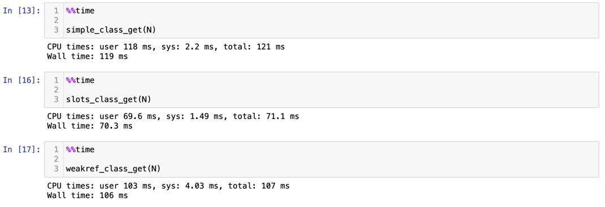

**Домашнее задание  №5**
==============================

## *1. Сравнение использования weakref и слотов*

### ***Создание пачки экземпляров***

Видно, что использование слотов сильно ускоряет создание экземпляров классов.
В то же время применение слабых ссылок совсем немного уменьшает время работы.

### ***Доступ к атрибутам***

### ***Изменение атрибутов***

### ***Удаление атрибутов***

В случае с доступом/изменением тенденция сохраяется. Для классов со 
слотами данные операции выполняются быстрее всего. Для обычных классов - дольше всего.
Однако с удалением ситуация немного меняется: классы со слабыми ссылками оказываются 
самыми медленными, но классы со слотами все также удерживают лидерство.

## *2. Профилирование*

### ***Профилирование вызовов***
1. Создание экземпляров

Поскольку время выполнения следующих операций существенно меньше, можем запустить их 10 раз 
и смотреть на cumtime percall для большей надежности эксперимента:

2. Обращение к атрибутам

3. Изменение атрибутов

4. Удаление атрибутов

Итак, снова убеждаемся в том, что классы со слотами работают быстрее классов со слабыми
ссылками, которые в свою очередь работают быстрее обычных.

### ***Профилирование памяти***

Предсказуемо, классы со слотами сильно экономят память (на 100 000 объектах примерно в 3 раза).
В то же время классы со слабыми ссылками, напротив, требуют больше места для хранения.
